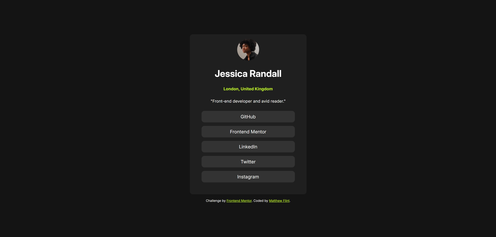

# Frontend Mentor - Social links profile solution

This is a solution to the [Social links profile challenge on Frontend Mentor](https://www.frontendmentor.io/challenges/social-links-profile-UG32l9m6dQ). Frontend Mentor challenges help you improve your coding skills by building realistic projects. 

## Table of contents

- [Overview](#overview)
  - [The challenge](#the-challenge)
  - [Screenshot](#screenshot)
  - [Links](#links)
- [My process](#my-process)
  - [Built with](#built-with)
  - [What I learned](#what-i-learned)
  - [Continued development](#continued-development)
  - [Useful resources](#useful-resources)
- [Author](#author)
- [Acknowledgments](#acknowledgments)


## Overview

Reflection on my Social Links Profile project for Frontend Mentor

### The challenge

Users should be able to:

- See hover and focus states for all interactive elements on the page

### Screenshot



### Links

- Solution URL: [https://github.com/Matthew-Flint/Social-Links-Profile](https://github.com/Matthew-Flint/Social-Links-Profile)
- Live Site URL: [https://matthew-flint.github.io/Social-Links-Profile](https://matthew-flint.github.io/Social-Links-Profile)

## My process

### Built with

- Semantic HTML5 markup
- CSS custom properties
- Flexbox

### What I learned

With this project, I was able to better understand the spacing by using gaps in Flexbox, as well as having more direct control over the pargins by using the universal selector to clear them like this: 

```css
* {
  margin: 0;
  padding: 0;
}
```
This, combined with seperating my elements into unique flexboxes, I was able to give the link buttons different spacing from each other than the top image from its headings, for example. 

It's still not 100% accurate to the design, but overall I'm happy with how my version of the project came pretty close and is still visually appealing. 

I also managed to practice a bit more with media queries to make the buttons shrink when the screen reaches a certain width, like this: 

```css
@media screen and (max-width: 350px) {
    .card {
        width: 300px;
    }
    .social-links a {
        min-width: 250px;
    }
}
```

### Continued development

I was working without a figma file this time, so the spacing isn't 100% accurate, nor is the size of all the fonts, but I'm at least glad I could get the colors and font family to match up. I'll keep refining this in future projects as it's the biggest challenge for me in my coding journey.


## Author

- Website - [Matthew Flint](https://github.com/Matthew-Flint)
- Frontend Mentor - [@Matthew-Flint](https://www.frontendmentor.io/profile/Matthew-Flint)


